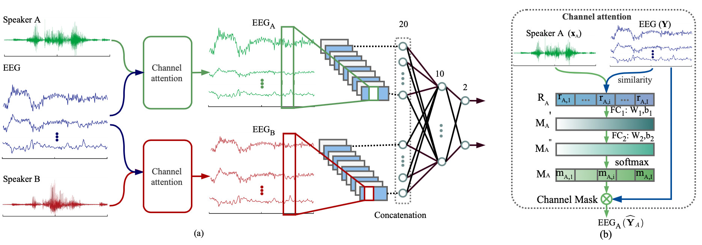

# Auditory Attention Detection with EEG Channel Attention

This repository contains the python scripts developed as a part of the work presented in the paper "Auditory Attention Detection with EEG Channel Attention"

## Getting Started

These files are extracted from the project stream, which contain the complete model and some training parameters.  In order to run the project, users need to write training and testing code, and use private or public datasets.

The public [KUL dataset](https://zenodo.org/record/3997352#.YUGaZdP7R6q) is used in the paper. The dataset itself comes with matlab processing program, please adjust it according to your own needs.

## Paper



Paper Link: [**Auditory Attention Detection with EEG Channel Attention**](https://ieeexplore.ieee.org/abstract/document/9630508)

The proposed CNN-CM neural architecture for auditory attention detection, which is trained as a whole with two output nodes for two attended speakers. 

(a) Overall architecture;

(b) Channel attention mechanism that modulates the input multi-channel EEG signals with respect to speaker A.

Please cite our paper if you find our work useful for your research:

```tex
@inproceedings{su2021auditory,
  title={Auditory attention detection with EEG channel attention},
  author={Su, Enze and Cai, Siqi and Li, Peiwen and Xie, Longhan and Li, Haizhou},
  booktitle={2021 43rd Annual International Conference of the IEEE Engineering in Medicine \& Biology Society (EMBC)},
  pages={5804--5807},
  year={2021},
  organization={IEEE}
}
```

## License

This project is licensed under the MIT License - see the [LICENSE](LICENSE) file for details

## Contact

Enze Su, Siqi Cai, Peiwen Li, Longhan Xie, Haizhou Li

Shien-Ming Wu School of Intelligent Engineering, South China University of Technology, Guangzhou, Guangdong Province, China.

Enze Su, Siqi Cai, Peiwen Li and Longhan Xie are with Shien-Ming Wu School of Intelligent Engineering, South China University of Technology, Guangzhou, Guangdong Province, China. Longhan Xie is the corresponding author. <enzesu@hotmail.com>, <elesiqi@nus.edu.sg>, <lintean@qq.com>, and <melhxie@scut.edu.cn>

Haizhou Li and Siqi Cai are with the Department of Electrical and Computer Engineering, National University of Singapore, Singapore. <haizhou.li@nus.edu.sg>

Haizhou Li is also with Machine Listening Lab, University of Bremen, Germany.


